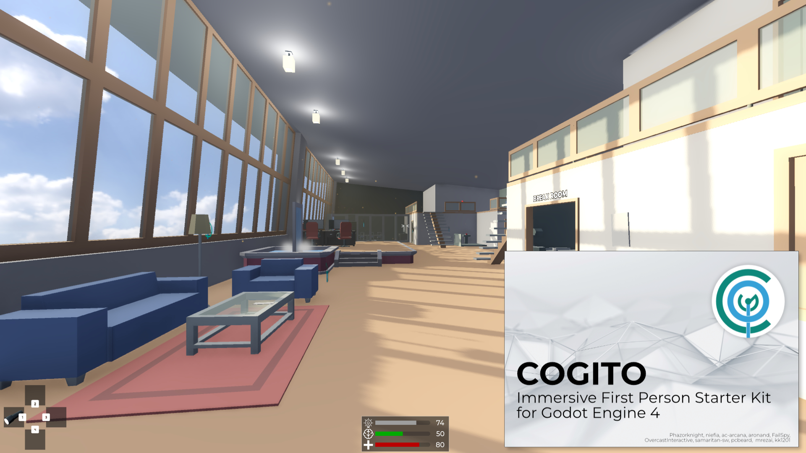

# COGITO has moved to Codeberg!

> [!IMPORTANT]
> Please go the [Codeberg repo](https://codeberg.org/Phazorknight/Cogito) for the latest versions, documentation and issues.




# COGITO

[](https://godotengine.org/) [](https://github.com/Phazorknight/Cogito)

## What is it?
Cogito is a First Person Immersive Sim Template Project for Godot 4, providing a framework for creating interactable objects, various items to use and mechanics to influence the player and game environment.
In short, with COGITO you get a quick start for a fully-featured first person game with a great variety of mechanics and a solid base to create your own.

### [Online documentation](https://cogito.readthedocs.io/en/latest/index.html)
### [Video tutorial series](https://cogito.readthedocs.io/en/latest/tutorials.html)
### [Cogito in the Godot Asset Store (beta)](https://store-beta.godotengine.org/asset/philip-drobar/cogito)

### Current Features
- First person player controller with:
  - Sprinting, jumping, crouching, sliding, stairs handling, ladder handling, sitting
  - Lots of exposed properties to tweak to your liking (speeds, headbob, fall damage, bunnyhop, etc.)
  - Easy-to-use dynamic footstep sound system
- Player Attribute System
  - Health, Stamina, Visibility for stealth, etc
  - Customize how attributes get displayed in the HUD (or stay hidden)
  - Also useable for RPG-like attributes (Strength, Wisdom, etc)
  - Interactions can check attributes (eg. you can only lift a box if you're strong enough)
- Interaction System
  - Component-based interactions makes it easy to turn your own objects interactive quickly and customize existing ones
  - Examples for interactive objects like doors, drawers, boxes to carry, turn-wheels, elevators, notes, keypads
- Inventory System
  - Flexible resource-based inventories
  - Grid-based (think Resident Evil 4)
  - Inventory UI separate from inventory logic
  - Examples for multiple item types (consumables, keys, ammo, weapons, combinable Items)
  - Base class to easily add your custom item types
  - Containers with their own inventories
- Basic NPC
  - NavigationAgent based enemy with component-based state machine + animation states
  - Simple player detection system that uses detection areas + basic line-of-sight checks
- Main menu, pause menu and Options menu
- Rebindable controls
- Full game pad support!
- Save and Load System as well as scene persistency
- Localization!
- Support for other plugins:
  - Works with Dialogic
  - Works with Dialgue Manager
- Work in progress:
  - Systemic Properties (wet/dry, flammable/on fire, soft, etc) (very WIP)
  - Basic Quest System

### Comes with fully featured Demo Scenes
- Set up like a game level including a variety of objects, weapons and quests
- Demo scenes contains hints that explain how objects in the scene were set up

COGITO is made by [Philip Drobar](https://www.philipdrobar.com) with help from [these contributors](https://github.com/Phazorknight/Cogito/graphs/contributors).

## Principles of this template
The structure of this template always tries to adhere to the following principles:
- **Complete**: When you download COGITO and press play, you get a functioning project out of the box. Game menu, save slot select, options and a playable level are all included.
- **Versatile**: Whether your game is set in the future, the past or the present, use melee, projectile or no weapons at all, have low poly, stylized or realistic graphics, the template will have features for you.
- **Modular**: Do not want to use a feature? You will be able to hide it, ignore it or strip it out without breaking COGITO. At the same time, COGITO is designed to be extendable with your own custom features or other add-ons.
- **Approachable**: While there will always be a learning curve, we strive to make COGTIO approachable and intuitive to use, so it doesn't get in your way of making your game.
- **No Generative AI**: All included code and assets are made by humans and listed in our credits and cotnributors page.

> [!IMPORTANT]  
> COGITO v1.1 is not 100% bug-free. While most features are set, be aware that this open source software is offered "as is". Use at your own risk and check Issues and Discussion pages for more information.

[Credits, Contributors and License](https://cogito.readthedocs.io/en/latest/about.html)

---

# FPS Project — Custom Systems

This project extends COGITO with a fully custom weapon system and additional first-person
shooter mechanics. Everything below lives in `Scripts/Weapons/` and `Scene/Weapom/` and
is designed to never modify `addons/cogito` directly.

---

## Additional Features (built on top of COGITO)

- **Custom weapon resource pipeline** — resource-driven fire modes, damage, range, recoil,
  and type-specific behaviour defined in `.tres` files, editable entirely from the Inspector
- **Tween-based ADS (Aim Down Sights)** — smooth position/FOV transition on right-click,
  with per-weapon ADS position, FOV, and recoil scale
- **Tween-based bolt cycle** — bolt-action rifles animate the bolt handle and viewmodel body
  independently via tweens; ADS-stable (no viewmodel snap when cycling while scoped)
- **Procedural sprint pose** — all wieldables ease into a raised sprint position on sprint
  enter/exit; weapons cannot fire or ADS while sprinting
- **Scope system** — SubViewport-based scope with variable magnification, custom reticle
  shader, and scoped sensitivity smoothing (`scope_controller.gd`)
- **Shell casing FX** — configurable ejection point, physics-enabled casings, active casing
  cap to avoid clutter (`shell_casing_fx.gd`)
- **Camera recoil** — per-weapon vertical/horizontal recoil with separate ADS recoil values
  (`weapon_recoil.gd`)
- **Shoot motion modes** — choose between tween-based kick (configurable out/return times
  and offsets) or animation-based shoot motion per weapon scene
- **Trigger animation** — bolt handle mesh rotates on primary action press/release

### Implemented Weapons
| Weapon | Type | Calibre | Notes |
|--------|------|---------|-------|
| AK-47  | Assault Rifle | 7.62×39mm | Full-auto, shell casings on fire |
| M700   | Bolt-Action Rifle | 7.62×51mm | Tween bolt cycle, TAC30 scope |

---

## Custom Weapon System

### Architecture

Each weapon follows a five-link chain:

```
Pickup scene (.tscn)
  └─ WieldableItemPD (.tres)          ← charge_max, charge_current, wieldable_scene
       └─ Weapon scene (.tscn)        ← cogito_weapon.gd, AnimationPlayer, mesh nodes
            └─ Weapon data (.tres)    ← Weapon_Resource subclass (fire mode, stats)
                 └─ Projectile scene (.tscn)  ← optional, for physical projectiles
```

**Never skip a link.** Wieldable item resources drive ammo display; weapon data resources
drive fire behaviour. Changing one without the other will break the weapon.

### Key Scripts

| Script | Purpose |
|--------|---------|
| `Scripts/Weapons/cogito_weapon.gd` | Root orchestrator — bridges all sub-systems into Cogito's `CogitoWieldable` interface |
| `Scripts/Weapons/Weapon_Resource.gd` | Base resource class — fire mode enum, virtual `fire()`, `can_fire()`, `on_post_fire()` |
| `Scripts/Weapons/Types/BoltAction_Resource.gd` | Bolt-action data + bolt tween parameters |
| `Scripts/Weapons/Types/AssaultRifle_Resource.gd` | Full-auto / burst data |
| `Scripts/Weapons/Types/Shotgun_Resource.gd` | Pump-action and semi-auto shotgun data |
| `Scripts/Weapons/Helpers/ads_controller.gd` | ADS enter/exit tween logic |
| `Scripts/Weapons/Helpers/shoot_motion_controller.gd` | Shoot kick tween |
| `Scripts/Weapons/scope_controller.gd` | Scope SubViewport, magnification, reticle shader |

### Adding a New Weapon

1. Create a weapon scene (Node3D root) with `cogito_weapon.gd` attached.
   Add `%Bullet_Point` (Marker3D), `AnimationPlayer`, and `AudioStreamPlayer3D`.
2. Create a `Weapon_Resource` subclass `.tres` for your fire mode and assign it to
   `weapon_data` on the scene root.
3. Create a `WieldableItemPD` inventory item and point `wieldable_scene` at your weapon scene.
4. Create a pickup scene using `CogitoPickup` or any COGITO-compatible pickup node.
5. Set `default_position` on the weapon scene to the hip-fire rest position.
6. Assign `bolt_part_node` (for bolt-action) or configure shell eject point as needed.

### Bolt Tween System (BoltAction_Resource)

When `bolt_part_node` is assigned on a bolt-action weapon scene, the bolt cycle is driven
entirely by tweens instead of AnimationPlayer keyframes. This keeps the sight picture
stable during ADS.

**Inspector fields (under "Bolt Tween" group in `BoltAction_Resource`):**

| Field | Description |
|-------|-------------|
| `bolt_locked_rotation` | Handle rotation when chambered (radians) |
| `bolt_unlocked_rotation` | Handle rotation when open |
| `bolt_position_forward` | Bolt rest position (forward/chambered) |
| `bolt_position_back` | Bolt pulled-back position |
| `bolt_unlock/pull/hold/push/lock_duration` | Duration in seconds for each phase |
| `bolt_root_position_offset` | Viewmodel body shift at peak of cycle (relative to current position) |

Set `bolt_part_node` on the weapon scene root to the NodePath of your bolt handle mesh.
Leave it empty to fall back to animation-based cycling.

---

## Project Setup Notes

### Project Root
The Godot project root is `godot-fps-cogito-master/`. All `res://` paths resolve from here.

### Folder Conventions
| Folder | Contents |
|--------|---------|
| `res://Scene/Weapom/Firearms/` | Weapon scenes, wieldable resources, weapon data resources |
| `res://Scene/Weapom/BulletProjectil&shelle/` | Projectile and shell casing scenes |
| `res://Scene/Attachment/Scope/` | Optic attachment scenes |
| `res://Scene/Items/Bullets/` | Ammo pickup scenes |
| `res://Scripts/Weapons/` | All weapon GDScript (orchestrator, resources, helpers) |
| `res://Assets/` | Imported meshes, textures, SFX |

> **Note:** The folder is named `Weapom` (not `Weapon`) and `BulletProjectil&shelle`
> (not `BulletProjectileShell`). Do not rename — scene references will break.

### Main Scene
`res://Scene/Town.tscn` is the current main/demo scene. It instances the COGITO player,
environment, and all weapon pickups.

### Input Actions (combat-relevant)
| Action | Default | Purpose |
|--------|---------|---------|
| `action_primary` | LMB | Fire |
| `action_secondary` | RMB | ADS |
| `reload` | R | Reload |
| `sprint` | Shift | Sprint (blocks fire and ADS) |
| `quickslot_1–4` | 1–4 | Equip weapon in slot |
